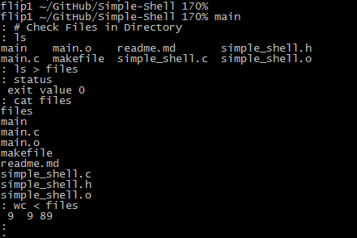
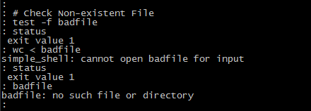
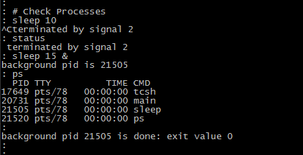
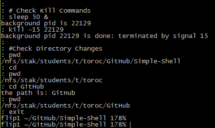

#Simple Shell

##About
This is a simple shell program written in C for an Operating Systems course. 

The shell runs command line instructions, returns results, and supports three builtin commands: cd, exit, and status. It also supports comments and blank lines, redirection of standard input/output, and foreground/background processes.

##Configuration

###How to build
The build process is controlled by the `makefile` and accepts the following commands:
```
make
make debug
make clean
```
To build the program run make at the command line in the current directory.

This will generate an executabled called `main`.

###How to run
To run the program, type
```
main
```
and proceed to enter command line commands.

##Screenshots
<table>
    <tr>
        <td>
            
        </td>
        <td>
            
        </td>
    </tr>
    <tr>
        <td>
            
        </td>
        <td>
            
        </td>
    </tr>
</table>


##License
All rights reserved.


     
     
